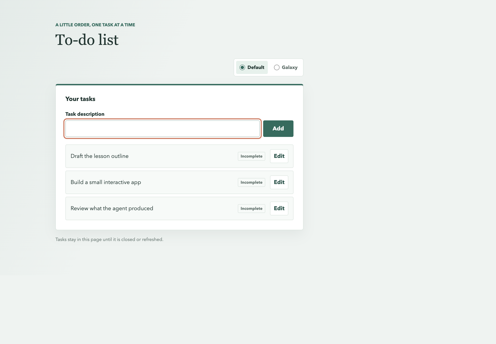
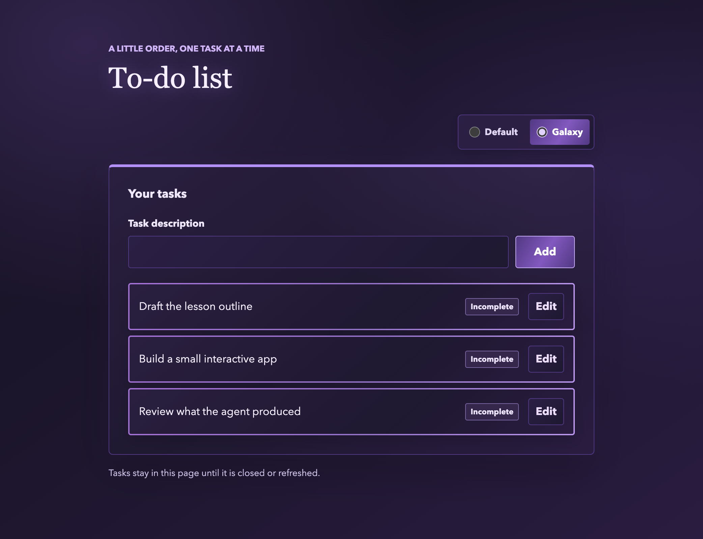

# To-do list

A small single-page To-Do application built with HTML, CSS, and browser-native JavaScript.

## Lesson Objective

This project is a hands-on lesson experiment: use the GitHub Copilot coding agent to turn a
specification into a working, deliberately small web app. The goal is to observe how quickly the
agent can move from requirements through planning and implementation, and to evaluate how
proficiently it delivers the requested behavior, handles edge cases, and preserves usability.

Learners can assess the result against the feature specifications, acceptance scenarios, browser
checks, and code review. The agent's output is a starting point for learning, not a substitute for
understanding or reviewing the submitted work.

## Run

Open `index.html` in a current web browser. No package installation, backend, database, or build
step is required.

Tasks are held in memory for the current page session and are cleared when the page is refreshed or
closed.

## Add Tasks

Enter a task description and select **Add**. Empty and whitespace-only descriptions are rejected;
surrounding whitespace is trimmed. Task descriptions are displayed as text.

## Edit Tasks

Select **Edit** on an existing task to rewrite its text. Select **Exit** to save non-empty text;
blank or whitespace-only edits remain unsaved until corrected. In edit mode, use the checkmark to
toggle completion or **X** to delete that task.

## Galaxy Theme

Use the **Appearance** options to switch between the default styling and Galaxy. Galaxy uses
blended purple gradients and shifting task borders. Reduced-motion preferences stop the border
animation while keeping its gradient. The default theme is selected again after reload.

## Screenshots

**Default theme**

**Galaxy theme**

## Feature Documentation

Specifications, implementation plans, task lists, and browser validation guides are in
[`specs/001-add-tasks/`](specs/001-add-tasks/), [`specs/002-edit-task/`](specs/002-edit-task/),
and [`specs/003-galaxy-theme/`](specs/003-galaxy-theme/).